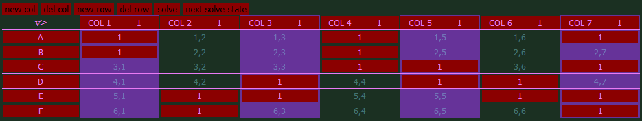

# Algorithm X With Overlapping Tiles

Knuth's [Algorithm X](https://en.wikipedia.org/wiki/Knuth's_Algorithm_X) details a method to solve exact cover problems, but it cannot handle overlapping tiles.

A demo of a modified Algorithm X which handles overlapping pieces can be found at [https://acarlson99.github.io/static/dlx/](https://acarlson99.github.io/static/dlx/) with its implementation here [https://github.com/acarlson99/acarlson99.github.io/tree/master/static/dlx](https://github.com/acarlson99/acarlson99.github.io/tree/master/static/dlx)

This is especially useful for extending AlgoX to operate on words which frequently have duplicate letters.

## Original Algorithm X

> From [https://en.wikipedia.org/wiki/Knuth's_Algorithm_X#Example](https://en.wikipedia.org/wiki/Knuth%27s_Algorithm_X#Example)
>
> 1. If the matrix _A_ has no columns, the current partial solution is a valid solution; terminate successfully.
> 2. Otherwise choose a column _c_ (deterministically).
> 3. Choose a row _r_ such that _A_r_,_c_ = 1 (nondeterministically).
> 4. Include row _r_ in the partial solution.
> 5. For each column _j_ such that _A_r_,_j_ = 1,
>    1. for each row _i such that A_i,j_ = 1
>       1. delete row _i_ from matrix _A._
>    2. delete column _j_ from matrix _A_.
> 6. Repeat this algorithm recursively on the reduced matrix _A_.

A classic Algorithm X [example](https://acarlson99.github.io/static/dlx/?x=WzEsMiwzLDQsNSw2LDdd&y=eyJBIjpbMSw0LDddLCJCIjpbMSw0XSwiQyI6WzQsNSw3XSwiRCI6WzMsNSw2XSwiRSI6WzIsMyw2LDddLCJGIjpbMiw3XX0=&ts=eyIxIjoxLCIyIjoxLCIzIjoxLCI0IjoxLCI1IjoxLCI2IjoxLCI3IjoxfQ==&as=eyJBIjp7IjEiOjEsIjQiOjEsIjciOjF9LCJCIjp7IjEiOjEsIjQiOjF9LCJDIjp7IjQiOjEsIjUiOjEsIjciOjF9LCJEIjp7IjMiOjEsIjUiOjEsIjYiOjF9LCJFIjp7IjIiOjEsIjMiOjEsIjYiOjEsIjciOjF9LCJGIjp7IjIiOjEsIjciOjF9fQ==)

A detailed breakdown of solving this matrix can be found by the curious at [https://en.wikipedia.org/wiki/Knuth's_Algorithm_X#Example](https://en.wikipedia.org/wiki/Knuth%27s_Algorithm_X#Example)

However, this only solves an **exact** cover. If we want 2 tiles to occupy `COL 7` this cannot be solved by base Algorithm X.

This can be solved by introducing a count representing the number of tiles we want to cover each column. Additionally, with this change the algorithm can be expanded to handle numbers > 1.

## Modified version

> New algorithm description with _Counts_
>
> 1. If the matrix _A_ has no columns, and _Counts_ all no non-zero values the current partial solution is a valid solution; terminate successfully.
> 2. Otherwise choose a column _c_ (deterministically).
> 3. Choose a row _r_ such that _A_r_,_c_ ≥ 1 (nondeterministically).
> 4. Include row _r_ in the partial solution.
> 5. For each column _j_ such that _A_r_,_j_ ≥ 1,
>    1. Reduce _Counts_j_ by _A_r,j._
>    2. for each row _i such that A_i,j_ > _Counts_j_
>       1. delete row _i_ from matrix _A._
>    3. delete column _j_ from matrix _A_.
> 6. Repeat this algorithm recursively on the reduced matrix _A_.

## Example

Consider this example where we want to cover column 7 twice `Counts = { 1:1, 2:1, 3:1, 4:1, 5:1, 6:1, 7:2 }`

|     | 1   | 2   | 3   | 4   | 5   | 6   | 7   |
| --- | --- | --- | --- | --- | --- | --- | --- |
| A   | 1   | 0   | 0   | 1   | 0   | 0   | 1   |
| B   | 1   | 0   | 0   | 1   | 0   | 0   | 0   |
| C   | 0   | 0   | 0   | 1   | 1   | 0   | 1   |
| D   | 0   | 0   | 1   | 0   | 1   | 1   | 0   |
| E   | 0   | 1   | 1   | 0   | 0   | 1   | 1   |
| F   | 0   | 1   | 0   | 0   | 0   | 0   | 1   |

**Level 0**

Step 1 - Non-empty matrix, we proceed.

Step 2 - Choose the column with the fewest 1s and is selected deterministically

|     | 1   | 2   | 3   | 4   | 5   | 6   | 7   |
| --- | --- | --- | --- | --- | --- | --- | --- |
| A   | 1   | 0   | 0   | 1   | 0   | 0   | 1   |
| B   | 1   | 0   | 0   | 1   | 0   | 0   | 0   |
| C   | 0   | 0   | 0   | 1   | 1   | 0   | 1   |
| D   | 0   | 0   | 1   | 0   | 1   | 1   | 0   |
| E   | 0   | 1   | 1   | 0   | 0   | 1   | 1   |
| F   | 0   | 1   | 0   | 0   | 0   | 0   | 1   |

Step 3 - Rows A and B each have a 1 in column 1 and are selected nondeterministically

**Level 1: Select Row A**

Step 4 - Row A is included in the partial solution

Step 5 - Row A has 1 in columns 1, 4, and 7

|     | 1   | 2   | 3   | 4   | 5   | 6   | 7   |
| --- | --- | --- | --- | --- | --- | --- | --- |
| A   | 1   | 0   | 0   | 1   | 0   | 0   | 1   |
| B   | 1   | 0   | 0   | 1   | 0   | 0   | 0   |
| C   | 0   | 0   | 0   | 1   | 1   | 0   | 1   |
| D   | 0   | 0   | 1   | 0   | 1   | 1   | 0   |
| E   | 0   | 1   | 1   | 0   | 0   | 1   | 1   |
| F   | 0   | 1   | 0   | 0   | 0   | 0   | 1   |

Column 1 has a 1 in rows _A_ and _B_; column 4 has a 1 in rows _A_, _B_, and _C_; and column 7 has a 1 in rows _A_, _C_, _E_, and _F_. `[1,4,7].map(a => Counts[a] -= 1)` results in `Counts[1] = 0; Counts[4] = 0; Counts[7] = 1;`

Thus, rows _A_, _B_, and _C_ are to be removed and columns 1 and 4 are to be removed:

|     | 1   | 2   | 3   | 4   | 5   | 6   | 7   |
| --- | --- | --- | --- | --- | --- | --- | --- |
| A   | 1   | 0   | 0   | 1   | 0   | 0   | 1   |
| B   | 1   | 0   | 0   | 1   | 0   | 0   | 0   |
| C   | 0   | 0   | 0   | 1   | 1   | 0   | 1   |
| D   | 0   | 0   | 1   | 0   | 1   | 1   | 0   |
| E   | 0   | 1   | 1   | 0   | 0   | 1   | 1   |
| F   | 0   | 1   | 0   | 0   | 0   | 0   | 1   |

The matrix now looks like this

|     | 2   | 3   | 5   | 6   | 7   |
| --- | --- | --- | --- | --- | --- |
| D   | 0   | 1   | 1   | 1   | 0   |
| E   | 1   | 1   | 0   | 1   | 1   |
| F   | 1   | 0   | 0   | 0   | 1   |

Step 1 - Matrix is non-empty— proceed

Step 2 - The lowest number of 1s in a column is 1

|     | 2   | 3   | 5   | 6   | 7   |
| --- | --- | --- | --- | --- | --- |
| D   | 0   | 1   | 1   | 1   | 0   |
| E   | 1   | 1   | 0   | 1   | 1   |
| F   | 1   | 0   | 0   | 0   | 1   |

Step 3 - Row D has a 1 in column 5 and is selected

**Level 2**

|     | 2   | 3   | 5   | 6   | 7   |
| --- | --- | --- | --- | --- | --- |
| D   | 0   | 1   | 1   | 1   | 0   |
| E   | 1   | 1   | 0   | 1   | 1   |
| F   | 1   | 0   | 0   | 0   | 1   |

Step 4 - Row D is included in the partial solution

Step 5 - Row D has a 1 in columns 3, 5, and 6 which sets the corresponding values in `Counts` to 0.

|     | 2   | 3   | 5   | 6   | 7   |
| --- | --- | --- | --- | --- | --- |
| D   | 0   | 1   | 1   | 1   | 0   |
| E   | 1   | 1   | 0   | 1   | 1   |
| F   | 1   | 0   | 0   | 0   | 1   |

Row F remains and columns 2 and 7 remain with `Counts = { 2:1, 7:1 }`

|     | 2   | 7   |
| --- | --- | --- |
| F   | 1   | 1   |

The continuation here is left as an exercise to the reader.

This results in a terminating solution of `[A,D,F]` before backtracking

**Level 1**

Step 4 - Select Row B, including it in the partial solution

Step 5 - Row B has a 1 in columns 1 and 4, reducing the corresponding values in `Counts` to 0.

|     | 1   | 2   | 3   | 4   | 5   | 6   | 7   |
| --- | --- | --- | --- | --- | --- | --- | --- |
| A   | 1   | 0   | 0   | 1   | 0   | 0   | 1   |
| B   | 1   | 0   | 0   | 1   | 0   | 0   | 0   |
| C   | 0   | 0   | 0   | 1   | 1   | 0   | 1   |
| D   | 0   | 0   | 1   | 0   | 1   | 1   | 0   |
| E   | 0   | 1   | 1   | 0   | 0   | 1   | 1   |
| F   | 0   | 1   | 0   | 0   | 0   | 0   | 1   |

Eliminate rows overlapping cols 1 and 4.

|     | 1   | 2   | 3   | 4   | 5   | 6   | 7   |
| --- | --- | --- | --- | --- | --- | --- | --- |
| A   | 1   | 0   | 0   | 1   | 0   | 0   | 1   |
| B   | 1   | 0   | 0   | 1   | 0   | 0   | 0   |
| C   | 0   | 0   | 0   | 1   | 1   | 0   | 1   |
| D   | 0   | 0   | 1   | 0   | 1   | 1   | 0   |
| E   | 0   | 1   | 1   | 0   | 0   | 1   | 1   |
| F   | 0   | 1   | 0   | 0   | 0   | 0   | 1   |

`Counts = { 2:1, 3:1, 5:1, 6:1, 7:2 }`

|     | 2   | 3   | 5   | 6   | 7   |
| --- | --- | --- | --- | --- | --- |
| D   | 0   | 1   | 1   | 1   | 0   |
| E   | 1   | 1   | 0   | 1   | 1   |
| F   | 1   | 0   | 0   | 0   | 1   |

Step 1 - non-empty, continue

Step 2 - The smallest number of 1s is 1, choose D

**Level 2**

|     | 2   | 3   | 5   | 6   | 7   |
| --- | --- | --- | --- | --- | --- |
| D   | 0   | 1   | 1   | 1   | 0   |
| E   | 1   | 1   | 0   | 1   | 1   |
| F   | 1   | 0   | 0   | 0   | 1   |

|     | 2   | 3   | 5   | 6   | 7   |
| --- | --- | --- | --- | --- | --- |
| D   | 0   | 1   | 1   | 1   | 0   |
| E   | 1   | 1   | 0   | 1   | 1   |
| F   | 1   | 0   | 0   | 0   | 1   |

Here we will choose row F, see that `Counts[7] = 1`, and terminate unsuccessfully

|     | 2   | 7   |
| --- | --- | --- |
| F   | 1   | 1   |
